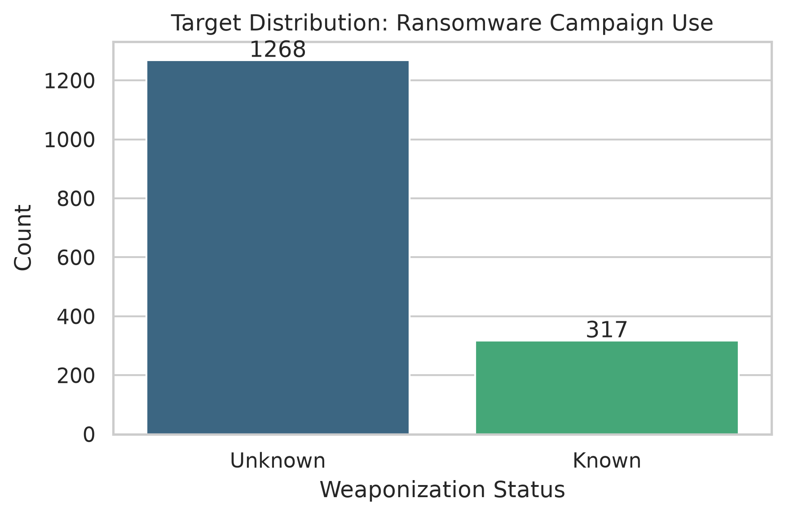
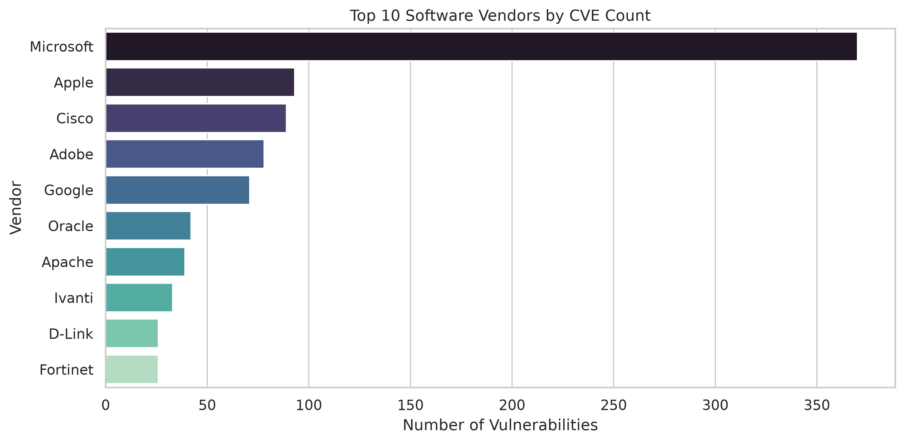
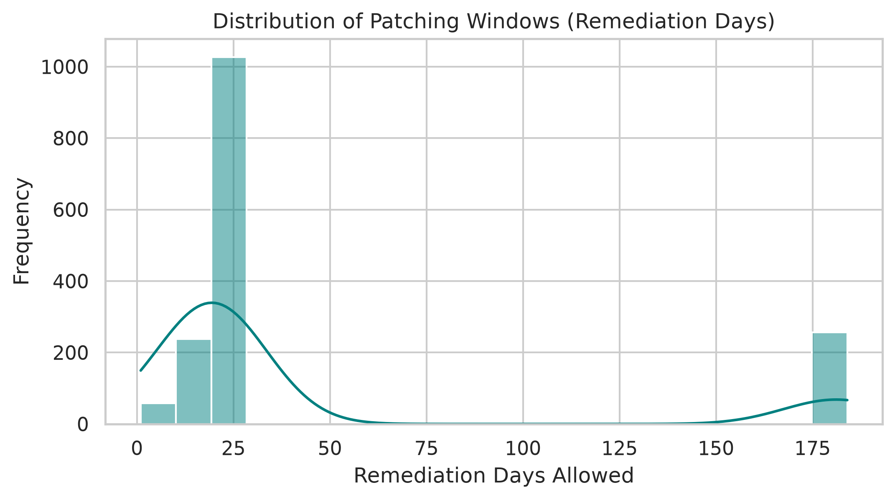
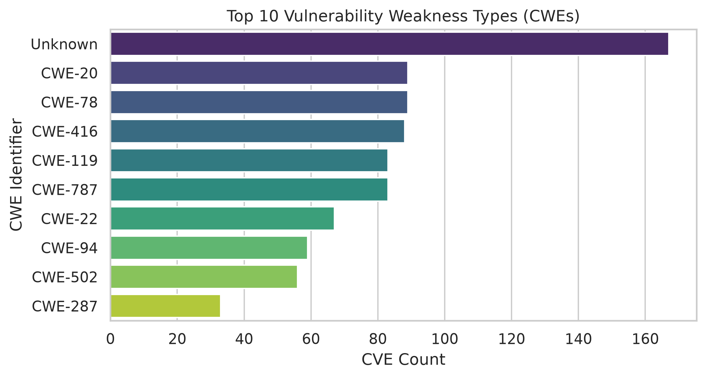

# Comparative Study of Machine Learning Algorithms for Ransomware Vulnerability Prediction

Student & Assessment Details
*  Sushant Adhikari

*  Machine Learning Final Assessment
*  Cybersecurity Attacks & Defense Dataset 2026 
(https://www.kaggle.com/datasets/chuneeb/ai-cybersecurity-threat-dataset-2026)


# 1. Project Overview & Problem Statement
Security Operations Center (SOC) teams face thousands of newly disclosed software vulnerabilities each year, creating a critical patch-prioritization bottleneck. Organizations cannot remediate all security flaws immediately and need automated systems to identify high-risk vulnerabilities.

The primary objective of this project is to build an automated machine learning classifier that predicts whether a software vulnerability (CVE) is weaponized and actively exploited in ransomware campaigns. By identifying structural patterns across software vendors, product types, and weakness categories, security teams can proactively prioritize critical security patches before active weaponization occurs.

# 2. Research Question
 How do feature scaling techniques impact the predictive performance (Accuracy, Precision, Recall, F1-Score) of standard machine learning algorithms (Logistic Regression, Decision Tree, Support Vector Machine, Multi-Layer Perceptron) compared to ensemble learning (Random Forest) when classifying ransomware-weaponized software vulnerabilities?

# 3. Dataset Summary
* **Dataset File:** `dataset/initial/2_cve_vulnerabilities.csv`
* **Total Instances:** 1,585 records
* **Total Features:** 9 input attributes (Vendor, Product, Vulnerability Name, Dates, Action Guidance, CWE Weaknesses)
* **Target Variable:** `knownRansomwareCampaignUse` (Binary Classification: `Known` vs. `Unknown`)
* **Class Distribution:**
  * `Unknown` (Not exploited in ransomware): 1,268 instances (80.00%)
  * `Known` (Exploited in ransomware): 317 instances (20.00%)
* **Selected Comparative Experiment:** Feature Scaling (Evaluating raw vs. `StandardScaler` normalized feature representations across all classifiers).


### Feature Dictionary

| Feature Name | Data Type | Preprocessing & Feature Engineering Strategy |
| :--- | :--- | :--- |
| `cveID` | String | Excluded (non-predictive unique ID) |
| `vendorProject` | Categorical | Grouped into Top 10 frequency threshold + `'Other'`, One-Hot Encoded |
| `product` | Categorical | Excluded due to extreme cardinality |
| `vulnerabilityName` | Text | Excluded from primary tabular matrix |
| `dateAdded` & `dueDate` | Datetime | Combined to construct continuous patch window: `remediation_days` |
| `remediation_days` | Continuous | Continuous numerical variable standardized via `StandardScaler` ($\mu=0, \sigma=1$) |
| `cwes` | Categorical | Grouped into Top 10 frequency threshold + `'Other'`, One-Hot Encoded |
| `knownRansomwareCampaignUse` | Binary | Mapped to binary integers (`Known`: 1, `Unknown`: 0) |

remediation_days is the continuous temporal feature created to measure the mandated patching window/urgency assigned to a vulnerability. It is calculated by taking the date difference between the mandated fix deadline (dueDate) and the date CISA added the vulnerability to the catalog (dateAdded):$$\text{remediation\_days} = \text{dueDate} - \text{dateAdded}$$


---
# 4. Repository Structure

```text
├── dataset/
│   ├── initial/                              # Original 2_cve_vulnerabilities.csv
│   └── processed/                            # Engineered features, scaled matrices, and stratified splits
├── notebooks/
│   ├── 01_eda.ipynb                          # Data profiling, EDA plots
│   ├── 02_preprocessing.ipynb                # Feature engineering, grouping, scaling
│   └── 03_model.ipynb                        # Model training, scaling experiments, 5-fold CV
├── reports/
│   └── figures/      # Saved plots (eda_class_distribution.png, eda_top_vendors.png, etc.)
├── requirements.txt  # Environment dependencies
└── README.md         # Documentation
```


# 5. Exploratory Data Analysis (EDA) Highlights

### 1. Target Class Imbalance
* **80% Unknown (1,268 instances)** vs. **20% Known (317 instances)**.
* Reflects the operational reality where ransomware-weaponized vulnerabilities represent a critical minority of total security flaws.

### 2. Software Vendor Distribution
* High vulnerability concentration in enterprise platforms (e.g., Microsoft, Apple, Cisco, Adobe, Google).
* Reflects widespread enterprise market deployment and extensive security research coverage rather than inherent code weakness.
* Justifies grouping lower-frequency vendors into an `'Other'` category to prevent feature space explosion during One-Hot Encoding.

### 3. Remediation Timelines (`remediation_days`)
* Extracted from mandated federal deadlines (`dueDate` - `dateAdded`), capturing the operational patching window for risk estimation.

### Visual EDA Artifacts

| Target Class Distribution | Top Software Vendors |
| :---: | :---: |
|  |  |
Patching Window Distribution | Top Common Weaknesses (CWEs) |
| :---: | :---: |
|  |  |
---


# 6. Instructions to Run Code
## Execution Order
1. Activate virtual environment: `source venv/bin/activate`
2. Install dependencies: `pip install -r requirements.txt`
3. Execute notebooks sequentially: `01` -> `02` -> `03`.

# . AI Usage Statement
AI tools (ChatGPT / Gemini) were utilized strictly for code debugging, syntax assistance, and structuring assessment guidelines. All data preprocessing, experimental execution, model evaluations, and research analyses were conducted independently.